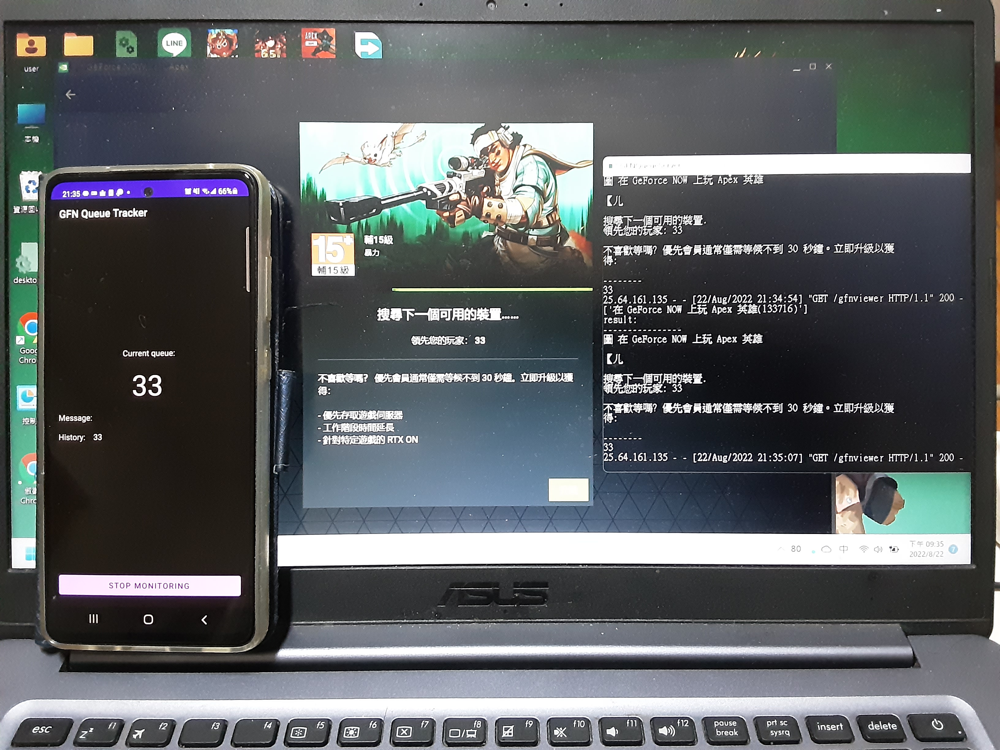

# GFN Queue Tracker

> 你絕對不知道等了4個小時的GFN之後，因為沒看到已經進去遊戲了所以idle太久又被系統踢出來重等有多痛苦。    －Kaiserouo

用來在手機上追蹤GeForce NOW排隊人數的android app。搭配[GFN Notifier](https://github.com/Kaiserouo/GFN-Notifier)使用。

Demo video: https://youtu.be/jcujfVqw4Y0

支援：
+ 可以從通知列的靜音通知看目前人數。
+ 在排隊人數低於某人數時給予通知。
+ 通知時以震動方式提醒。
+ 對API傳一次性要求(requests list)，e.g. 開啟遊戲，開啟TeamViewer等。
+ 在追蹤人數時在app裡面看過去人數的歷史紀錄 (用於OCR辨識錯誤時人腦判斷)。

## How to use
1. 安裝app。你可以用android studio把專案開起來送到手機裡。
2. URL照GFN Notifier那邊得到的URL設定好。
    + 應該會是長`http://<ip>:<port>/gfnviewer`。
3. `START MONITOR`即可開始追蹤；進入`REQUESTS LIST`可以看能做什麼一次性要求。

在`START MONITOR`後，通知列會有靜音通知，會寫目前排隊的人數。點通知的話會回到app。

在追蹤期間可以關閉app，下次開啟的時候會直接到顯示排隊人數的頁面。
如果要停止追蹤的話 (i.e. 把靜音通知整個關掉)，請進入app後點選`STOP MONITORING`。或者如果人數成為負值 (已經進入遊戲或者出現錯誤) 的話會自動結束。

## Settings
+ `URL`: API的位址，ref. GFN Notifier。
+ `Alert count`: 在排隊人數低於某人數時給予通知。
+ `Vibrate when alarm`: 通知時要不要有震動。